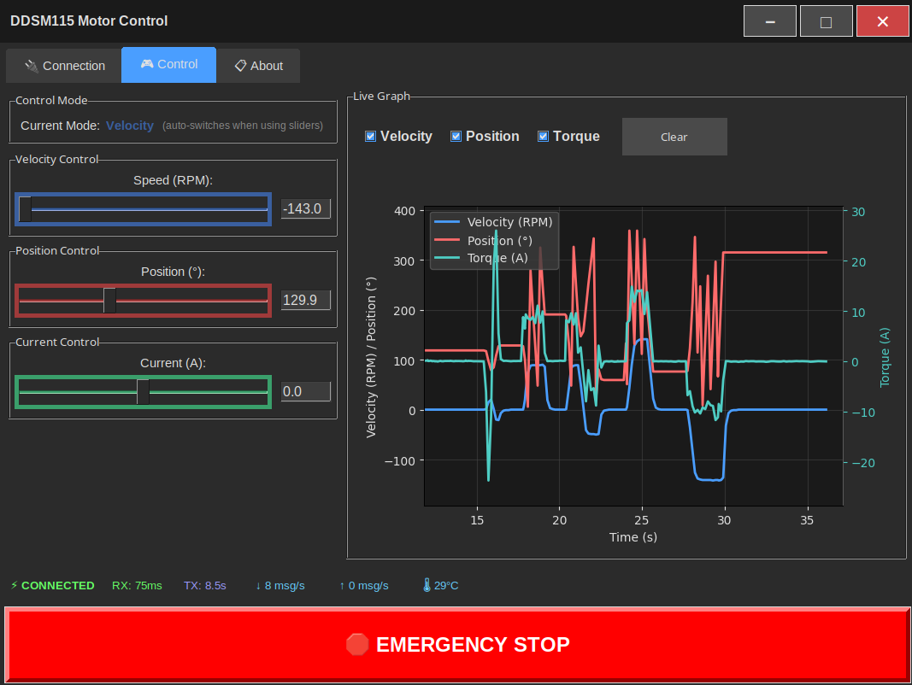

# DDSM115 Motor Control GUI

A complete GUI application for controlling DDSM115 servo motors via RS485 communication.

  

## 📸 Screenshots

<table>
<tr>
<td width="33%">

<p align="center"><strong>Connection Setup</strong><br>Auto-detects motors and serial ports</p>
</td>
<td width="33%">

<p align="center"><strong>Motor Control</strong><br>Velocity, current, and position control</p>
</td>
<td width="33%">

<p align="center"><strong>System Information</strong><br>Diagnostics and system details</p>
</td>
</tr>
</table>

## ✨ Features

- **Full Motor Control**: Velocity, current, and position control modes
- **Real-time Monitoring**: Live status updates with 50ms precision
- **Auto-detection**: Automatically finds motors on connection
- **Safety Features**: Emergency stop, communication monitoring
- **User-friendly Interface**: Tabbed interface with clear controls
- **Data Logging**: Export motor data to CSV
- **Sequence Control**: Run automated movement sequences

## 🔧 Hardware Requirements

- **Motor**: DDSM115 Direct Drive Servo Motor (Waveshare)
- **Interface**: USB to RS485 adapter
- **Power**: 12-24V DC supply for motor (18V recommended)
- **Computer**: Any computer with USB port running Python 3.8+

## 🚀 Quick Start

### Simple Start (Recommended)

1. **Download all files to a folder**
2. **Run the unified launcher**:
   ```bash
   chmod +x start.sh
   ./start.sh
   ```
   - Automatically handles first-time setup
   - Creates virtual environment if needed
   - Installs dependencies automatically
   - Launches the application

3. **Connect your hardware**:
   - Connect motor to 12-24V power supply
   - Connect USB-RS485 adapter between computer and motor
   - Power on the motor

### Alternative Installation Methods

**Manual Setup**:
```bash
# Install dependencies manually
pip install pyserial matplotlib numpy
python3 src/ddsm115_gui.py
```

**Development Setup**:
```bash
# Use existing setup scripts
chmod +x scripts/setup.sh
./scripts/setup.sh
```

## 📱 Using the Application

### 1. Connection
- Select your USB-RS485 port (usually `/dev/ttyUSB0` or `/dev/ttyACM0`)
- Click **Connect**
- Motors will be auto-detected and displayed

### 2. Control Modes

**🏃 Velocity Control**:
- Range: -330 to 330 RPM
- Good for continuous rotation applications

**⚡ Current Control**:
- Range: -8A to 8A  
- Direct torque control

**📍 Position Control**:
- Range: 0° to 360°
- Precise positioning with holding

### 3. Safety Features

**🛑 Emergency Stop**:
- Immediately stops motor
- Stops any running sequences
- Switches to safe velocity mode

**📊 Real-time Monitoring**:
- Adjustable scan rate (50ms - 5000ms)
- Live position, velocity, torque display
- Temperature monitoring

## ⚙️ Configuration

### Serial Settings
- **Baudrate**: 115200 (default, don't change)
- **Timeout**: 200ms
- **Protocol**: Custom 10-byte with CRC8

### Motor Settings
- Motors use IDs 1-10 (auto-detected)
- Multiple motors supported on same bus
- Each motor needs unique ID

## 🔍 Troubleshooting

### Connection Issues
```
❌ No serial ports found
→ Check USB-RS485 adapter is connected
→ Check driver installation

❌ Connection failed
→ Try different port (/dev/ttyUSB0, /dev/ttyACM0)
→ Check motor power supply
→ Verify RS485 wiring
```

### Motor Not Responding
```
❌ No motors detected
→ Check motor power (12-24V)
→ Verify RS485 connections (A+, B-, GND)
→ Try manual ID scan in Connection tab

❌ Motor doesn't move
→ Check emergency stop isn't active
→ Verify motor is enabled
→ Check error codes in monitoring tab
```

### Performance Issues
```
❌ Slow updates
→ Reduce monitoring interval to 100-200ms
→ Disable unnecessary logging

❌ Commands not working
→ Check motor is in correct mode
→ Use emergency stop and try again
→ Verify no sequences are running
```

## 📋 System Requirements

### Minimum Requirements
- **OS**: Windows 10, macOS 10.14, or Linux (Ubuntu 18.04+)
- **Python**: 3.8 or higher
- **RAM**: 100MB
- **Disk**: 50MB

### Dependencies
- `pyserial>=3.5` (for RS485 communication)
- Standard Python libraries (tkinter, threading, etc.)

### Tested Platforms
- ✅ Ubuntu 20.04/22.04 (x64)
- ✅ Windows 10/11 (x64)
- ✅ macOS 11+ (Intel/Apple Silicon)
- ✅ Raspberry Pi OS (ARM)

## 🔐 Safety Notes

⚠️ **Important Safety Information**:

- Always use emergency stop if motor behaves unexpectedly
- Ensure adequate power supply (minimum 2A at 18V)
- Check connections before powering on
- Motor can generate significant torque - secure mounting
- Use appropriate fusing/protection in power circuit

## 📁 Project Structure

```
ddsm115-motor-control/
├── start.sh              # Unified launcher (handles setup & launch)
├── requirements.txt      # Python dependencies
├── README.md            # This documentation
├── .gitignore           # Git ignore rules
├── src/                 # Source code
│   ├── ddsm115.py           # Core motor control library
│   ├── ddsm115_gui.py       # GUI application
│   ├── example_cli.py       # Command-line example
│   ├── motor_diagnostic.py  # Diagnostic tools
│   ├── motor_command_queue.py # Command queue system
│   └── gui_diagnostic.py    # GUI diagnostic tools
├── tests/               # Test suite
│   ├── test_*.py            # Unit tests
│   └── stress_test_gui.py   # Stress testing
├── scripts/             # Development scripts
│   ├── setup.sh             # Development setup
│   ├── install.sh           # Installation script
│   ├── run.sh              # Run script
│   └── setup.py            # Python setup
├── docs/                # Documentation
└── ddsm115-portable/    # Generated portable installation
```

## 🔧 Library Usage (Without GUI)

### Basic Example
```python
from src.ddsm115 import DDSM115

# Create motor controller
motor = DDSM115(port="/dev/ttyUSB0")

# Connect
if motor.connect():
    # Find motors
    motors = motor.scan_motors()
    
    # Control motor
    motor_id = motors[0]
    motor.set_velocity(motor_id, 100)  # 100 RPM
    
    # Get feedback
    feedback = motor.request_feedback(motor_id)
    print(f"Position: {feedback.position}°")
    
    # Stop and disconnect
    motor.emergency_stop(motor_id)
    motor.disconnect()
```

### Advanced Example with Callbacks
```python
from src.ddsm115 import DDSM115, MotorFeedback

def on_feedback(motor_id: int, feedback: MotorFeedback):
    print(f"Motor {motor_id}: {feedback.position:.1f}°")

motor = DDSM115()
motor.on_feedback = on_feedback
motor.connect()

# Start automatic monitoring
motor.start_monitoring([1, 2, 3], interval=0.1)
```

## 🤝 Support

### Getting Help
1. Check the troubleshooting section above
2. Run the debug script: `python3 debug_modes.py`
3. Check the connection log in the GUI
4. Verify hardware connections

### Common Solutions
- **Port permission issues (Linux)**: `sudo usermod -a -G dialout $USER`
- **Driver issues (Windows)**: Install CH340/FTDI drivers
- **Python/tkinter missing**: Install python3-tk package

## 📄 License

This project is licensed under the MIT License - see the LICENSE file for details.

## 🔗 Related Documentation

- [DDSM115 Motor Specifications](https://www.waveshare.com/wiki/DDSM115)
- [RS485 Communication Guide](docs/DDSM115_Protocol_Specification.md)
- [Python Serial Documentation](https://pyserial.readthedocs.io/)

---

**Quick Start Summary**:
1. Install Python 3.8+
2. Run: `chmod +x start.sh && ./start.sh`
3. Connect motor hardware
4. Click "Connect" in the GUI and start controlling!