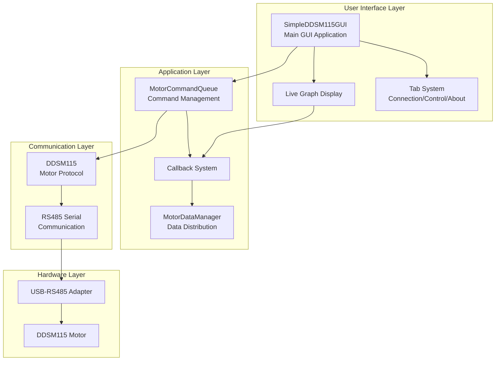
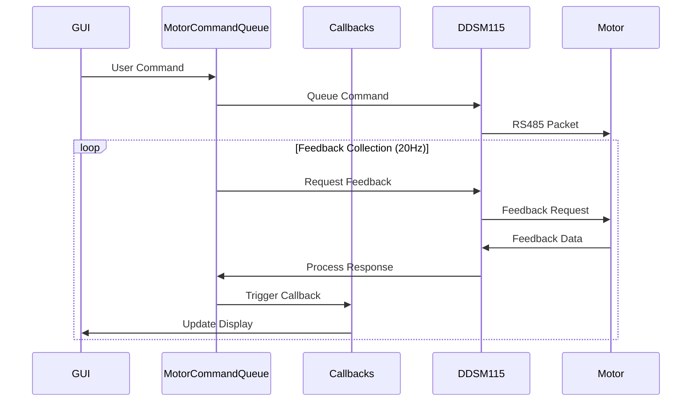
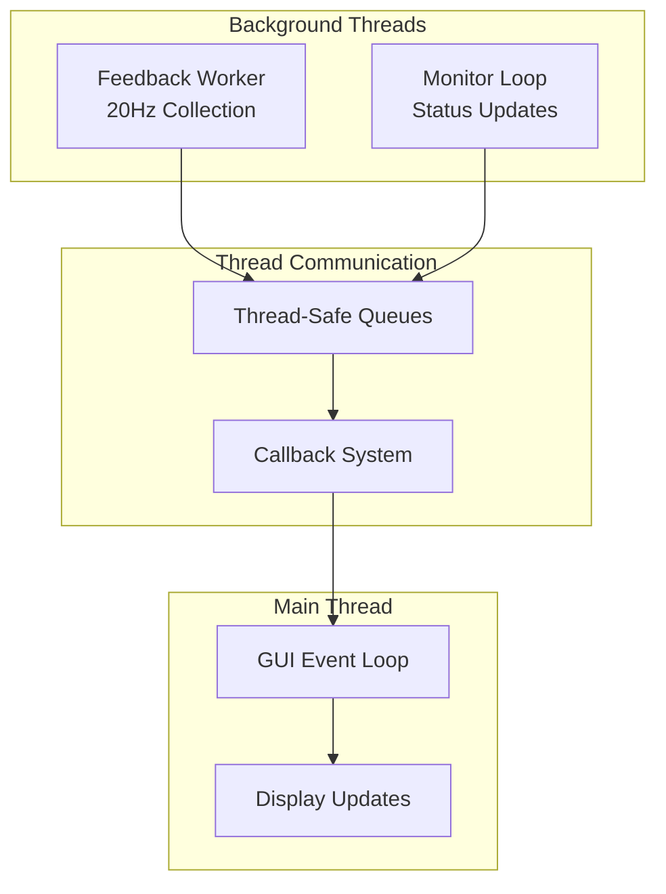
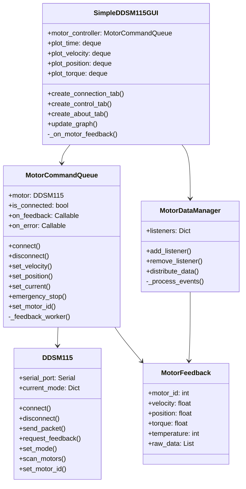

# DDSM115 Motor Control System Architecture

## System Overview

The DDSM115 Motor Control System is a comprehensive GUI application for controlling DDSM115 servo motors via RS485 communication. The system follows a layered architecture with clear separation of concerns.

## Component Architecture

### 1. User Interface Layer

#### SimpleDDSM115GUI (Main Application)
- **Purpose**: Main application window and UI management
- **Responsibilities**:
  - Window management and custom controls
  - Tab navigation (Connection, Control, About)
  - User input handling
  - Real-time status display
  - Theme and styling management

#### Live Graph Display
- **Purpose**: Real-time visualization of motor data
- **Features**:
  - Matplotlib integration with Tkinter
  - Dual Y-axis for velocity/position and torque
  - Configurable display options
  - Automatic scaling and updates
  - "No data received" indicator

#### Tab System
- **Connection Tab**: Port selection, motor detection, communication setup
- **Control Tab**: Motor control modes, live graph, command interface
- **About Tab**: System information, diagnostics, documentation

### 2. Application Layer

#### MotorCommandQueue
- **Purpose**: Manages command flow and feedback collection
- **Key Features**:
  - Thread-safe command queuing
  - Automatic feedback collection at 20Hz
  - Callback system for data distribution
  - Error handling and recovery
  - Connection state management

#### MotorDataManager
- **Purpose**: Centralized data distribution hub
- **Architecture**:
  - Observer pattern implementation
  - Queue-based event distribution
  - Support for multiple listeners
  - Thread-safe data access

#### Callback System
- **Purpose**: Event-driven data flow
- **Callbacks**:
  - `on_feedback`: Motor feedback data
  - `on_error`: Error notifications
  - `on_command_sent`: Command confirmations

### 3. Communication Layer

#### DDSM115 Protocol Implementation
- **Purpose**: Motor protocol handling
- **Features**:
  - 10-byte packet format with CRC8
  - Command types: Velocity, Current, Position, Emergency Stop
  - Motor ID management (1-10)
  - Feedback request/response handling
  - Mode switching logic

#### RS485 Serial Communication
- **Configuration**:
  - Baudrate: 115200
  - Timeout: 200ms
  - Half-duplex communication
  - Binary protocol

### 4. Hardware Layer

#### USB-RS485 Adapter
- Converts USB to RS485 signals
- Supports multiple motors on single bus
- Auto-detection via serial port enumeration

#### DDSM115 Motor
- Direct drive servo motor
- 12-24V DC operation
- RS485 communication interface
- Built-in encoder and controller

## Data Flow Architecture

## Threading Model

## Class Hierarchy

## Key Design Patterns

### 1. Observer Pattern
- Used in callback system and data distribution
- Decouples data producers from consumers
- Enables multiple UI components to receive updates

### 2. Command Pattern
- MotorCommandQueue implements command queuing
- Enables undo/redo capabilities
- Provides command history and logging

### 3. Singleton Pattern
- Serial port management ensures single connection
- Prevents resource conflicts

### 4. Factory Pattern
- Motor creation and initialization
- Configurable motor types and protocols

## Performance Considerations

### Data Collection
- Feedback collection at 20Hz per motor
- Circular buffers (deque) limit memory usage
- Maximum 200 data points for graph display

### Thread Safety
- Queue-based communication between threads
- Minimal lock contention
- GUI updates scheduled on main thread

### Resource Management
- Automatic cleanup on disconnection
- Graceful error handling
- Connection state monitoring

## Security Considerations

### Input Validation
- Motor ID range checking (1-10)
- Command parameter validation
- Serial port access control

### Error Handling
- Timeout protection
- CRC validation
- Connection loss recovery

### Safety Features
- Emergency stop functionality
- Mode switching protection
- Temperature monitoring

## Future Architecture Enhancements

### Planned Improvements
1. Plugin system for custom motor types
2. Remote control API
3. Data logging and replay
4. Multi-motor synchronized control
5. Advanced trajectory planning

### Scalability Considerations
- Support for larger motor networks
- Distributed control architecture
- Cloud-based monitoring
- Mobile app integration